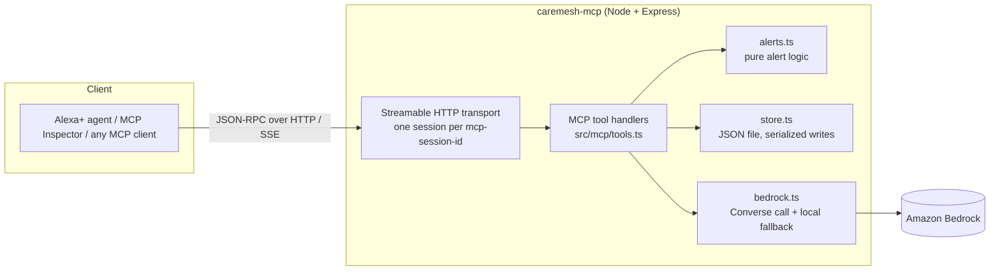
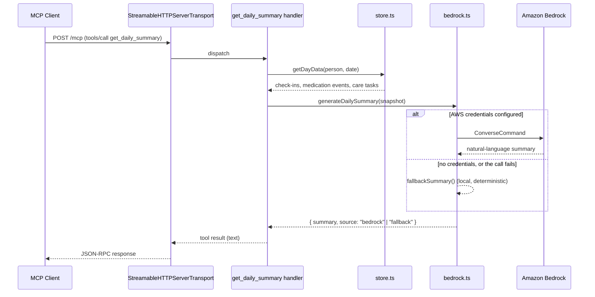

# Architecture

## System overview

Every tool call arrives as JSON-RPC over HTTP (spec `2025-11-25`, Streamable HTTP transport). The transport is session-scoped — `initialize` creates a session keyed by `mcp-session-id`, and each session gets its own `McpServer` instance (see `src/server.ts`). Tool handlers are thin: they validate input via Zod (declared per-tool in `src/mcp/tools.ts`), then delegate to one of three plain modules.

## Request flow: `get_daily_summary`

This is the most involved tool, so it's the clearest illustration of how the pieces fit together:

The other five tools follow the same shape minus the Bedrock branch: handler → Zod-validated input → `store.ts` (or `alerts.ts` for `get_alerts`) → formatted text result.

## Data model

Three flat, append-only event types, each scoped by `person` (see `src/types.ts`):

- **CheckIn** — `person`, optional `note`/`mood`, `timestamp`
- **MedicationEvent** — `person`, `medication`, `taken`, `timestamp`
- **CareTask** — `person`, `task`, optional `due`, `done`, `createdAt`

`store.ts` persists these to a single JSON file (`data/store.json` by default, `DATA_FILE` env override for tests/demos), with writes serialized through a promise queue so concurrent tool calls can't race a read-modify-write cycle (see the `concurrent writes don't clobber each other` test in `test/store.test.ts`).

## Design decisions

**Streamable HTTP, not stdio or SSE.** This is what Amazon's own Alexa+ track resources link to directly (MCP spec `2025-11-25`), and it's the only transport that works with a remote client rather than a locally-spawned process — required for a self-hosted server an Alexa+ agent would actually call.

**In-memory session state, single instance.** `transports` is a plain `Map` in `server.ts`. That's correct for a hackathon-scale deployment but means the server can only run as **one instance** — see the `minTaskCount`/`maxTaskCount: 1` pinning in the [deployment docs](../README.md#deploying-amazon-ecs-express-mode). Scaling beyond one instance would need session state moved to something shared (DynamoDB, Redis) so any instance behind the load balancer can serve any session.

**JSON file store, not a managed database.** Deliberately minimal for this scope — the interesting AWS integration here is Bedrock, not the datastore. `store.ts` is the single seam where this would swap to DynamoDB if this went past a demo; nothing else in the codebase depends on the storage mechanism.

**Bedrock call with a local fallback, not a hard dependency.** `bedrock.ts` only attempts a real Bedrock call when AWS credentials/region are present, and falls back to a deterministic local summary on any failure (missing credentials, network, throttling). This keeps the server runnable and testable with zero AWS setup, while the Bedrock path is a real, documented integration rather than a placeholder — `get_daily_summary`'s response reports which path (`bedrock` or `fallback`) actually produced the text.

**Pure functions for anything worth testing.** `computeAlerts` (`alerts.ts`) and `fallbackSummary` (`bedrock.ts`) are both plain functions with no I/O, so they're unit tested directly (`test/alerts.test.ts`, `test/bedrock.test.ts`) without needing to spin up the MCP transport or a real server.
