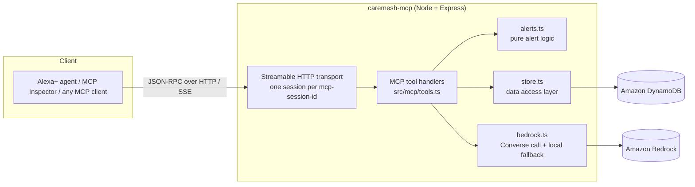
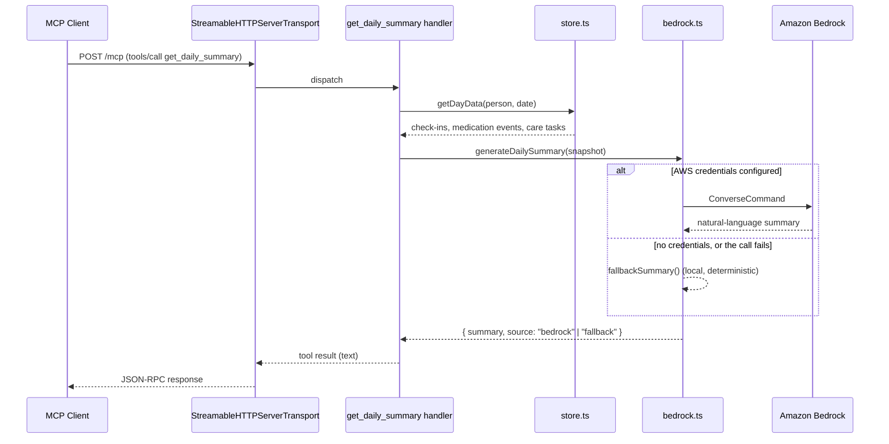

# Architecture

## System overview

Every tool call arrives as JSON-RPC over HTTP (spec `2025-11-25`, Streamable HTTP transport). The transport is session-scoped: `initialize` creates a session keyed by `mcp-session-id`, and each session gets its own `McpServer` instance (see `src/server.ts`). Tool handlers are thin, they validate input via Zod (declared per-tool in `src/mcp/tools.ts`), then delegate to one of three plain modules.

## Request flow: `get_daily_summary`

This is the most involved tool, so it's the clearest illustration of how the pieces fit together:

`get_household_summary` follows the same shape, just fanning `getDayData`/`generateHouseholdSummary` out across every member of a household instead of one person (see `get_household_summary` in `src/mcp/tools.ts`). The remaining eight tools follow a simpler version of the same shape, with no Bedrock branch at all: handler, then Zod-validated input, then `store.ts` (or `alerts.ts` for the two alert tools), then a formatted text result.

## Data model

Three flat, append-only event types, each scoped by `person` (see `src/types.ts`):

- **CheckIn**: `person`, optional `note`/`mood`, `timestamp`
- **MedicationEvent**: `person`, `medication`, `taken`, `timestamp`
- **CareTask**: `person`, `task`, optional `due`, `done`, `createdAt`

Plus one grouping type that doesn't follow the same shape:

- **Household**: `household` (partition key, no sort key), `members` (a DynamoDB String Set of person names)

`store.ts` persists these to four DynamoDB tables (one per type), keyed by `person` (partition key) plus `timestamp` for check-ins/medication events or `id` for care tasks, and by `household` alone for the households table (`src/dynamodb.ts`). Locally and in CI this points at [DynamoDB Local](https://docs.aws.amazon.com/amazondynamodb/latest/developerguide/DynamoDBLocal.html) via `DYNAMODB_ENDPOINT`; a real deployment omits that env var so the AWS SDK talks to regional DynamoDB using the task's IAM role instead. DynamoDB's own per-item atomicity is what replaces the JSON-file version's write-serialization queue (see the `concurrent writes don't clobber each other` test in `test/store.test.ts`). Household membership goes further and uses an `ADD` update on the String Set attribute specifically, so adding the same person twice is a no-op and concurrent adds of different people can't race each other, with no read-modify-write at all.

## Design decisions

**Streamable HTTP, not stdio or SSE.** This is what Amazon's own Alexa+ track resources link to directly (MCP spec `2025-11-25`), and it's the only transport that works with a remote client rather than a locally-spawned process, which is required for a self-hosted server an Alexa+ agent would actually call.

**In-memory session state, single instance.** `transports` is a plain `Map` in `server.ts`. That's correct for a hackathon-scale deployment but means the server can only run as **one instance**: see the `minTaskCount`/`maxTaskCount: 1` pinning in the [deployment docs](../README.md#deploying-amazon-ecs-express-mode). Scaling beyond one instance would need session state moved to something shared (DynamoDB, Redis) so any instance behind the load balancer can serve any session.

**DynamoDB, provisioned ahead of time in production.** The app never calls `CreateTable` against real AWS. `ensureLocalTablesExist` (`dynamodb.ts`) only runs when `DYNAMODB_ENDPOINT` is set, which is exclusively the local/CI case. A real deployment provisions the four tables via the AWS CLI first (see the [deployment docs](../README.md#deploying-amazon-ecs-express-mode)), so the app's IAM task role never needs `CreateTable`/`DeleteTable` permissions, only the read/write actions it actually uses.

**Four tables, not one single-table design.** DynamoDB best practice often favors a single table for related entities, but the entities here have genuinely different shapes: check-ins/medication events are queried by day (`begins_with` on an ISO timestamp sort key), care tasks are queried by person with no date dimension, and households are keyed by `household` with no `person` in the key at all. Separate tables map directly onto `store.ts`'s per-entity functions and read more clearly than one table carrying a synthetic composite key just to force everything into the same shape, which matters more than idiomatic-DynamoDB-ness at this scale.

**Bedrock call with a local fallback, not a hard dependency.** `bedrock.ts` only attempts a real Bedrock call when AWS credentials/region are present, and falls back to a deterministic local summary on any failure (missing credentials, network, throttling). This keeps the server runnable and testable with zero AWS setup, while the Bedrock path is a real, documented integration rather than a placeholder: `get_daily_summary`/`get_household_summary`'s response reports which path (`bedrock` or `fallback`) actually produced the text. `get_household_summary` reuses the same per-person prompt-building and fallback logic (`fallbackSummary`) rather than duplicating it, so the household version is genuinely just "the same thing, once per member, with one combined write-up."

**A shared bearer token, not full OAuth.** MCP's spec supports OAuth for remote servers, but that's real infrastructure (an authorization server, token issuance/refresh flows) disproportionate to what a single-tenant demo deployment needs. `MCP_AUTH_TOKEN` (checked with a constant-time comparison in `server.ts`, unset by default so local dev/Inspector/the demo script need no setup) closes the actual gap, an open `/mcp` endpoint on a public URL, without building infrastructure nothing here would exercise. One real consequence of this choice: MCP Inspector's client treats a bare 401 as an invitation to attempt OAuth dynamic client registration, which 404s against this server (no OAuth endpoints exist) rather than surfacing the underlying 401 cleanly. The server sends a standard `WWW-Authenticate: Bearer` header on 401s regardless (correct per RFC 7235 either way), but the fix on the client side is just to supply the token manually: see the README's Inspector troubleshooting note.

**`env.ts` imported first, not `.env` loaded ad hoc.** ES module imports evaluate before the importing file's own top-level code runs, regardless of where a same-file "load `.env`" call is textually placed, so loading it once in `server.ts` isn't early enough for modules `server.ts` transitively imports (e.g. `bedrock.ts`'s module-level `AWS_REGION`/`BEDROCK_MODEL_ID` constants, read at import time). `env.ts` is a side-effect-only module with no imports of its own, and every module that reads `process.env` at its own top level imports it first, guaranteeing `.env` is loaded before that read happens regardless of the module's position in the overall dependency graph.

**Pure functions for anything worth testing.** `computeAlerts`/`computeHouseholdAlerts` (`alerts.ts`) and `fallbackSummary`/`fallbackHouseholdSummary` (`bedrock.ts`) are all plain functions with no I/O, so they're unit tested directly (`test/alerts.test.ts`, `test/bedrock.test.ts`) without needing to spin up the MCP transport or a real server.
